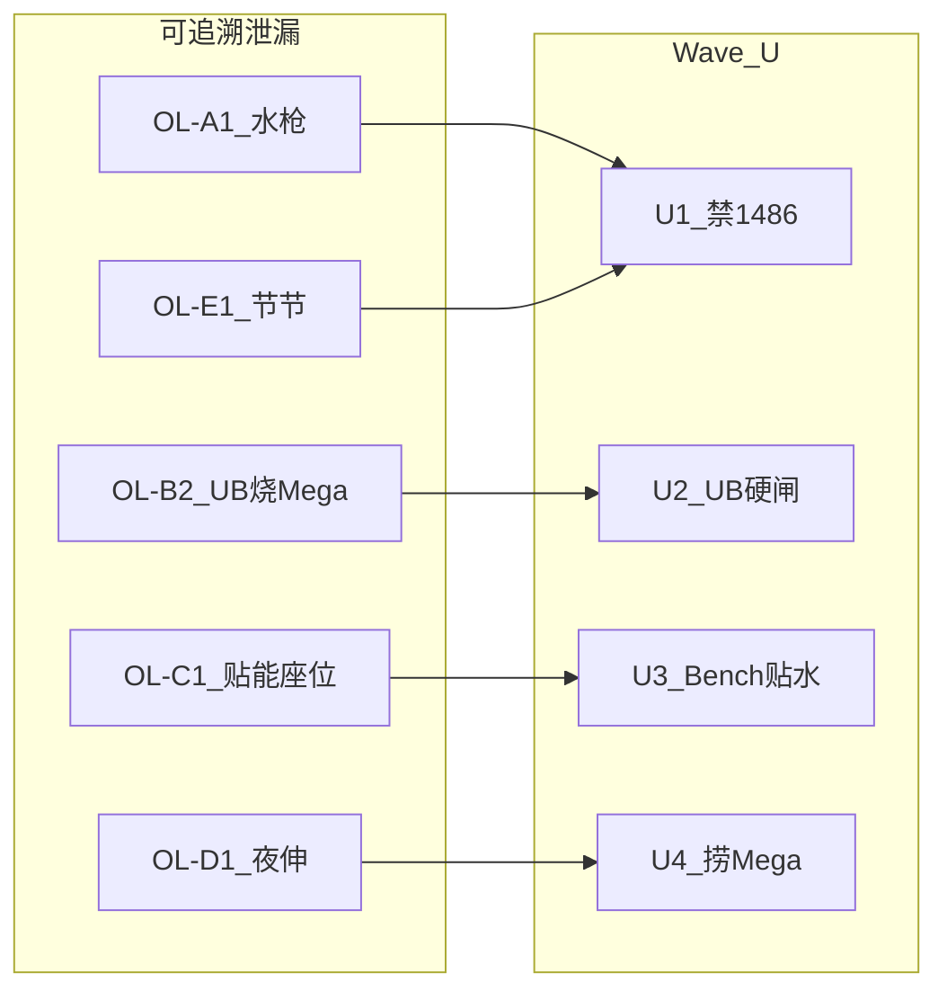

# 线上可追溯失误模式目录（sub `55299191`）

> 来源：Kaggle public episodes 人工复盘 + 引擎日志核验（2026-08-07）。  
> Replay / 时间线：[`logs/kaggle_episodes_waveL/`](../../logs/kaggle_episodes_waveL/)  
> 核验原文：[`CONFIRM_90446639_90442721.md`](../../logs/kaggle_episodes_waveL/CONFIRM_90446639_90442721.md)  
> 对应窄刀：Wave U（U1–U5）— 见 [`logs/h2h_audit_waveU_online/WAVE_U.md`](../../logs/h2h_audit_waveU_online/WAVE_U.md)

本目录只收录**可用 replay 日志稳定识别**的模式（cardId / attackId / select 选项 / 弃牌区）。  
标签≠死因的 H2H 归因（`no_861`、UB-burn-as-WR 等）不进本表。

---

## 如何扫一局（最短路径）

### Kaggle replay

```bash
kaggle competitions replay <episode_id> -p logs/kaggle_episodes_waveL/
# 我方 seat = TeamNames 中 Ying Peter 的下标
# 关键日志：type=15 attackId / type=10 PLAY / type=11 ATTACH / type=8 RETREAT
#          type=12 EVOLVE / type=6 区域移动（含 UB 检索入户、弃牌）
```

### 本地 H2H（vs 历史最佳基线 `55202093`）

同一套 OL 标签可扫本地 audit 目录（中文 `games/*.log`；有 `--save-jsonl` 时 A1/B2/D1 置信度更高）：

```bash
# 可选重跑（建议加 jsonl）
PYTHONPATH=submission_starmie:submission_starmie/pilot \
  python3 scripts/h2h_loss_audit.py \
  --baseline /tmp/baseline_55202093_f07e541 \
  -n 200 --seed 140000 --tag waveU_ol_scan --logs losses --rules-only --save-jsonl

python3 scripts/scan_ol_patterns.py --audit-dir logs/h2h_audit_waveU_online
# → OL_PATTERNS.md（计数 / 负局率 / lift）+ ol_hits.jsonl
```

解读：负局命中高但 lift≈0 → 标签≠死因；已刀模式（A1/B1/B2/C1/D1/E1）负局应近 0，否则开回归 trace；未刀（E2/E3/E4）需 lift 显著才允许开窄刀。  
首扫结果：[`logs/h2h_audit_waveU_online/OL_PATTERNS.md`](../../logs/h2h_audit_waveU_online/OL_PATTERNS.md)

| 信号 | 日志字段 |
|---|---|
| 底座水枪 | `type=15, attackId=1486, cardId=1030` |
| Mega 攻击 | `type=15, attackId=1487, cardId=1031` |
| 高级球 | `type=10, cardId=1121` → 随后 `type=6` 弃 2 + 检索入户 |
| 贴水 | `type=11, cardId=3, cardIdTarget=1030` |
| 撤退换人 | `type=8, cardIdActive / cardIdBench` |
| 夜伸 | `type=10, cardId=1097` → `type=6 fromArea=DISCARD→HAND` |
| 节节进化 | `type=12, cardId=66`（或 MAIN 选项 `OptionType.EVOLVE` + hand 66） |

证据局约定：Ying Peter = 我方；submission `55299191`。

---

## 模式总表

| ID | 模式名 | 证据局 | Wave U | 状态 |
|---|---|---|---|---|
| OL-A1 | 底座海星水枪（1486） | 90447438、90444305、90443511 死后 | U1 | **已刀** |
| OL-A2 | 保护前场撤退上有水底座 | 90447438 T1、90443511 T1 | U5（先手含羞苞子集） | **部分已刀** |
| OL-B1 | 手有 Mega+水仍打高级球 | 90444305 | U2（硬非法 + UB-2） | **已刀** |
| OL-B2 | 第二张 UB 弃牌集锁死烧 Mega | 90443511 | U2 forced-burn | **已刀** |
| OL-C1 | 双海星水贴必死 Active | 90444305 | U3 | **已刀** |
| OL-D1 | Mega 死后夜伸捞水不捞 Mega | 90443511 | U4 | **已刀** |
| OL-E1 | 可进化节节却不进化（卡手） | 90447438 | U1（evolve 压 END） | **已刀** |
| OL-E2 | Mega 后手有基本不铺 → 空替补败 | 90446639 | — | **未刀**（避 Wave M） |
| OL-E3 | 手环可选节节却选雪童子 | 90442721 | — | **未刀**（OPENING 挂起） |
| OL-E4 | 有恶能猿交替上未成型海星 | 90442721 | — | **未刀** |
| OL-F1 | 击杀后裸晋级底座（替补厚度不足） | 90446639 | — | **未刀**（晋级步常 forced） |

---

## 模式详述

### OL-A1 — 底座海星水枪

**识别**
- 我方 `attackId=1486` 且当时 Active=`1030`
- 同期 MAIN 常含 `EVOLVE`（节节）或手持 Mega 可落地，却仍选攻击
- 非 `attack_required`（场上无已加油可开火 Mega）

**决策链（修前）**  
`_ban_basic_attack` 仅在 dig 名单 / 手持 Mega 可进化时触发 → demote `-1150` 软平局 → ATTACK 胜出。

**根因**  
硬禁缺口 + demote 深度不够。

**刀口**  
U1：`is_basic_attack_forbidden(STARYU)` 在非 must-attack 一律真；Layer1 用 `_ATTACH_ILLEGAL`。

---

### OL-A2 — 保护前场 / 含羞苞 → 撤退上有水底座

**识别**
- `type=8`：`cardIdActive∈{65,235}`（弟弟/含羞苞）→ `cardIdBench=1030`（且该海星已有水）
- 先手 T1：整回合 MAIN **无任何** `OptionType.ATTACK`（规则禁攻），仍撤退

**决策链（修前）**  
`mega_clock` / OPENING 推有水 Staryu 上位，压过含羞苞墙 / 弟弟保护。

**根因**  
先手禁攻轮仍当「要开火」推底座；非「能痒痒不用」。

**刀口**  
U5：先手 My-T1 Active 含羞苞 → RETREAT / SWITCH 上 Staryu 非法。  
一般「弟弟保护却推底座」未做全局禁（避免撞挂起 OPENING）。

---

### OL-B1 — 手有 Mega+水仍打高级球

**识别**
- 打 `1121` 前手牌已含 `1031` +（`3` 或线上已有水）+ 场上有 `1030`
- 检索结果常为侧线（如另一张 Mega 雪妖女 `861`），牌库选项含喵头目 `1071` 等

**决策链（修前）**  
UB-2 已常把 `ball_allowed=False`，但 PLAY 仅 `-PATH` demote，软分仍可打出。

**根因**  
闸有、执行不硬。

**刀口**  
U2：`ball_allowed=False` → PLAY UB = `_ATTACH_ILLEGAL`；手持 Mega `discard_value≥10000`。

---

### OL-B2 — UB forced-burn Mega

**识别**
- 连续两张 `1121`
- 第二张打出后手牌仅剩 `1031` + `3`（或等价：弃牌日志出现刚检索入户的 Mega）
- 引擎弃牌 `min=max=2` → 必弃 Mega

**决策链（修前）**  
不检查「打出后能否选出 2 张非 Mega」。

**刀口**  
U2：`_ub_would_force_burn_mega` → `ball_allowed=False`。

**注意**  
与 H2H「UB 烧 Mega → WR」SOP-D NO-GO 不矛盾：那里是标签 lift≈0；这里是**可避免的决策非法形**。

---

### OL-C1 — 双海星水贴必死 Active

**识别**
- 场上 Active+Bench 均有 `1030`
- `type=11` 水贴 **Active** `1030`，Bench 海星仍干
- 下回合对手击杀 Active，水随宠进弃牌；晋级后 Mega `E=∅`

**决策链（修前）**  
`_attach_priority_bonus` 对干 Staryu 同分，不区分座位。

**刀口**  
U3：Active 为 Staryu 且（Bench 有干海星 **或** Active `appearThisTurn`）→ Active 贴水非法，Bench 贴水 PATH。

---

### OL-D1 — Mega 死后夜伸捞水不捞 Mega

**识别**
- Mega `1031` 进弃牌后打 `1097`
- 弃牌同时有 `1031` 与 `3`；`type=6` 入户的是水不是 Mega
- 随后给底座贴水并推上台被秒

**决策链（修前）**  
`_recover_target`：`need_energy` → 水硬优先于 Mega。

**刀口**  
U4：场上无 Mega 且弃牌有 Mega 且（`need_evolution` 或场上有 Staryu）→ 先 Mega；场上已有 Mega 缺油仍先水。

---

### OL-E1 — 土龙节节可进化却不进化

**识别**
- MAIN 选项含 `EVOLVE` 手牌 `66` → 场上弟弟，实选 `ATTACK:1486` 或 END
- 全剧情无 `type=12 cardId=66`（节节从未落地）

**决策链（修前）**  
`_draw_plan` 缺口未关 → evolve FORBID/0 分；水枪又不禁。

**刀口**  
U1：禁水枪 + MAKE_ATTACKER 时节节 evolve `_DOMINATE`、END demote。

---

### OL-E2 — Mega 后空替补（手有基本不铺）

**识别**
- 场上 Mega 成型后 `bench=[]`（或击杀后只剩空）
- 手牌长期有 `112`（愿增猿）/ `66` 等可铺基本，无对应 `type=6 toArea=BENCH`

**证据**  
90446639。

**状态**  
未刀。与 Wave M「强抬 Munk PLAY」冲突；若开刀必须是 **bench_empty 防空** 窄闸，并先做 SOP-D 频率/lift。

---

### OL-E3 — 手环第二拍错目标（节节可得却选雪童子）

**识别**
- `type=10 cardId=1152`（手环）检索选项含 `66`，实选 `860`
- 常叠加：罗盘已保证弟弟进场

**证据**  
90442721。

**状态**  
未刀（OPENING 宽改序挂起）。批量扫 `55299191` 频率后再议。

---

### OL-E4 — 有恶能猿交替上未成型海星

**识别**
- 恶能已在 `112` 上；打出 `1123`（交替）后 Active 变为有水/无 Mega 的 `1030`
- 交替选项含弟弟等非底座

**证据**  
90442721。

**状态**  
未刀。

---

### OL-F1 — 击杀后裸晋级底座

**识别**
- Active 被击杀时 Bench 仅 `1030`（或晋级 `nopt=1`）
- 对手 Active 已是成型大伤害源

**证据**  
90446639（该步引擎强制；根因是击杀前厚度）。

**状态**  
未刀；应归「击杀前铺厚度 / 节节」，不是晋级选择器。

---

## 决策链总览（修前 → Wave U）



---

## 批量 SOP-D 建议查询（未刀模式）

对 `55299191` public episodes 计数 + 胜负 lift（仅当 lift 显著再开刀）：

1. **OL-E2**：终局前 ≥3 回合 `bench_count=0` 且手牌曾有 `112`/`65`/`66`  
2. **OL-E3**：手环 select 选项含 `66` 却选 `860`  
3. **OL-E4**：交替后 Active=`1030` 且同回合前恶能在猿上  
4. **OL-A1 回归**：Wave U 提交后 `attackId=1486` 发生率应为 ≈0（非 must-attack）

---

## 相关代码锚点

| 模式 | 函数 |
|---|---|
| OL-A1 / E1 | `turn_planner.is_basic_attack_forbidden` / `_ban_basic_attack`；`starmie_pilot._turn_plan_hard_bonus` |
| OL-B1 / B2 | `turn_planner._acquire_plan` / `_ub_would_force_burn_mega` |
| OL-C1 | `starmie_pilot._attach_priority_bonus` / `_bench_has_dry_staryu` |
| OL-D1 | `turn_planner._recover_target` |
| OL-A2（先手含羞苞） | `starmie_pilot._going_first_budew_stay_bonus` |

单测：[`tests/test_wave_u_online_leaks.py`](../../tests/test_wave_u_online_leaks.py)
