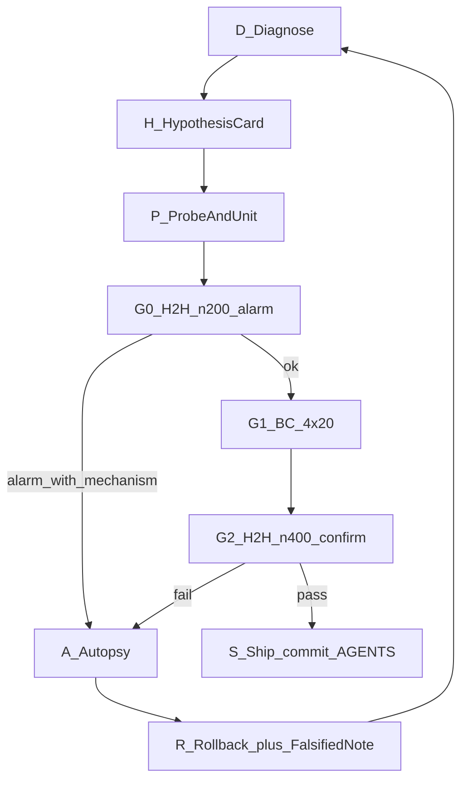

# Starmie Pilot 迭代 SOP

> 目标：杜绝「改一刀 → n=200 抽奖 → 不过就回滚换维」。  
> 约束：先归因、一波一刀、失败必解剖、噪声闸不单独定罪。  
> 适用：Layer1 硬规则 / TurnPlan / OPENING·AGGRESSION·HARVEST 政策迭代。

---

## 0. 四条红线

1. **先归因，后改码** — 没有「死因 → 杠杆 → 预期表变」不得动 Layer1。  
2. **一波一刀** — 一个 Wave 只改一条因果链；禁止顺手叠第二刀。  
3. **失败必解剖** — 回滚不是结案；必须写下「已证伪：…」，禁止同因再试。  
4. **噪声闸不单独定罪** — libcg 同 seed 也不复现；n=200 只能报警，不能单独宣判窄刀死刑（除非 seat B&lt;40% 且伴随机制证据，或 n=400 确认）。

---

## 1. 权威面（每次开波前写死）

写在计划与 `AGENTS.md`「当前状态」中，缺一不可：

| 项 | 内容 |
|---|---|
| **政策 commit / 标签** | 例：Wave I + Wave L |
| **H2H 权威** | 路径 + n + WR / seat A / seat B |
| **BC 对照** | 同 seed 池路径与关键 KPI |
| **本波禁止清单** | 例：OPENING demote、Boss −PATH、强追 Munk |

未写权威面 → **不准开刀**。

现行权威面（随 `AGENTS.md` 更新，此处不重复数字）。

---

## 2. 阶段机（固定顺序）



### D — 归因（改码前）

从**权威面**日志回答三问（必须写进计划，禁止口头带过）：

1. **负局最大头是什么？**（BC `loss_tags` / H2H path 桶 / setup_miss）  
2. **它落在哪条决策链？**（`must_close` / TurnPlan prep / OPENING / HARVEST…）  
3. **最小杠杆是什么？**（只点名 1 个函数 / 1 个序 / 1 条 hard bonus）

工具优先级：

- 汇总：`logs/h2h_audit_*/SUMMARY.md`、`logs/combat_eval_*/combat_eval_bc_n80.json`  
- 机制：`HARD_RULE_TRACE=1` + `scripts/summarize_hard_rule_trace.py`  
- DP 转化：`scripts/probe_dp_actions.py`（决策级，不是胜率）

**过不了 D → 停，只做归因任务，不开 Wave。**

### H — 假设卡（改码前）

必须填满，否则不准写代码：

```text
Wave: <名>
锚定: <权威面标签与日志路径>
死因: <tag / 桶>
杠杆: <文件::函数 / 一行行为变更>
不做: <黑名单>
预期变好: <1–2 个主 KPI，带基线数字>
预期不变: <Boss / seat B / ready_mega_no_attack …>
证伪条件: <何种表变 = 假设错>
回滚条件: <硬禁线>
```

- **合格例**：Wave L — 负局 `no_effective_boss` → fueled Mega + plan `boss_target` 时 Boss PLAY 满 PATH；预期 `effective_boss_rate`↑。  
- **不合格例**：「先抬 DP 看看」——无决策链、无证伪条件。

### P — 探针 + 单测（H2H 前）

1. 改码后必须：`python3 scripts/sync_starmie_submission.py`  
2. **行为单测**：刀口场景 + ≥1 条「禁止误伤」回归（OPENING / Boss / GS T1…）  
3. **决策探针**：有脚本则跑；否则对 5～10 局开 hard-rule trace，确认「该赢 PATH 的 option 真的赢了」  
4. 禁止：单测绿了就直接把 n=200 当科学结论

### G0 — H2H n=200（报警闸，非死刑庭）

建议命令：

```bash
PYTHONPATH=submission_starmie:submission_starmie/pilot \
  python3 scripts/h2h_loss_audit.py \
  --baseline /tmp/baseline_55202093_f07e541 \
  -n 200 --seed 140000 --tag <wave_tag> --logs losses --rules-only
```

判定（相对本波对照，默认 Wave L smoke：~51% / B47%）：

| 区 | 条件 | 动作 |
|---|---|---|
| **绿** | 总 WR、seat B 在噪声带内 | 进入 G1 |
| **黄** | 总 OK 但 seat B 掉 ≥5pp | **停**，进 A 解剖；不自动开 BC；不宣判维度死亡 |
| **红** | seat B&lt;40% 或总 WR&lt;45% | 立即停 BC，进 A；有机制证据再回滚 |

### G1 — BC 4×20（结构闸）

同 seed 池（现行 `seed0=93000`，四副 BC 对手）：

```bash
PYTHONPATH=submission_starmie:submission_starmie/pilot \
  python3 scripts/run_combat_eval.py \
  --games 20 --seed0 93000 \
  --decks alakazam_main,dragapult,lucario_fighting,marnie_froslass_munk \
  --bc alakazam_main,dragapult,lucario_fighting,marnie_froslass_munk \
  --out-dir logs/combat_eval_<wave>_bc_4x20
```

只看假设卡里的主 KPI + 不变约束：

- 主 KPI 未按预期动 → 假设错 → A（禁止「再叠一刀补」）  
- 不变约束破（如 `effective_boss_rate` 掉向已知失败带）→ 红，A + 回滚

### G2 — H2H n=400（政策确认）

唯一起码可更新「权威 H2H」的闸。n=200 绿不能单独把 Wave 封进权威面。

```bash
PYTHONPATH=submission_starmie:submission_starmie/pilot \
  python3 scripts/h2h_loss_audit.py \
  --baseline /tmp/baseline_55202093_f07e541 \
  -n 400 --seed 140000 --tag <wave_tag>_n400 --logs losses --rules-only
```

通过标准（默认）：总 WR 不差于权威面；seat B 不出现 Wave K/M 式崩盘。

### A — 解剖（失败必做）

至少输出并落盘（计划附录或 `logs/.../AUTOPSY.md`）：

1. 对照权威面：多输在哪些 seat / path 桶  
2. 抽 **≥10** 局目标负局：硬规则赢家是谁（trace 或引擎 log）  
3. 一句话证伪：「曾以为 X，实际是 Y / 或噪声未证实」  
4. 若机制成立 → 更新禁止清单

### R — 回滚 + 落盘

- 代码回到权威政策面 + `sync_starmie_submission.py`  
- `AGENTS.md` 记录：Wave 名、日志路径、**已证伪结论**、下一刀不得重犯  
- **未完成 A 的回滚 = 违规**

### S — 过闸上船

- 用户要求时再 commit（不擅自 push）  
- 更新权威面数字与「下一刀」  
- 黑名单只增不默删

---

## 3. 闸门数字（现行默认）

| 闸 | 用途 | 现行线 |
|---|---|---|
| G0 n=200 | 报警 | B&lt;40% 或 WR&lt;45% → 红；B 相对对照掉 ≥5pp → 黄 |
| G1 BC 4×20 | 结构 | 主 KPI 相对对照改善或持平；Boss / `ready_mega_no_attack` 等不变约束不破 |
| G2 n=400 | 封权威 | 总 WR 不差于权威；seat B 无 K/M 式崩 |

修订阈值时必须写进该波假设卡，不得口头改闸。

---

## 4. 维度挂起规则

某维连续 **两次** 在 A 中被证伪为「伤 seat B / 伤权威 KPI 且无替代杠杆」→ 写入挂起表，**只读观测**，直到出现**新的决策级证据**（不是「再猜一刀」）。

**现行挂起（与 `AGENTS.md` 同步）：**

| 维度 | 状态 | 依据 |
|---|---|---|
| OPENING 硬 demote / Poffin trim | 挂起 | Wave J/K |
| 中盘 DP 宽刀（Boss demote / PLAY Munk 加分） | 挂起 | Wave M |
| 中盘 DP 仅 `_dp_prep_steps` 序 | **禁止再试**（直至决策探针） | Wave N 解剖：`logs/h2h_audit_waveN_dp/AUTOPSY.md` — `munk_dark` 未升；seat B 掉点未获机制定罪；无 trace 前不得再改序 |
| 「DP 硬改已榨干」口头结论 | **作废** | 属无 A 时的过度推断；宽刀挂起 ≠ 维度死亡 |
| HARVEST 861 建造/开火（为刷 `no_861`） | **挂起** | Wave O 归因：`logs/diagnose_waveO_861/DIAGNOSE.md` — `no_861` 胜负 lift+0；胜局亦不做 861 |
| 全局再收紧 `must_close` / Jetting（为刷 `no_attack`） | **挂起** | Wave P 归因：`logs/diagnose_waveP_no_attack/DIAGNOSE.md` — `ready_mega_no_attack=0`；真零攻样本过小且偏胡地 |
| OPENING 宽 demote（为刷 seat B `no_mega`） | **挂起维持** | seat B 归因：`logs/diagnose_seatB_no_mega/DIAGNOSE.md` — 主簇线死/砖 |
| mega_clock「options 接地禁用 facts」 | **禁止原样再试** | Wave Q：`logs/h2h_audit_waveQ_mega_clock/AUTOPSY.md` |
| `can_evolve_now` 仅修 `appearThisTurn` | **禁止原样再试** | Wave R：`logs/h2h_audit_waveR_appear/AUTOPSY.md` — dump 过、H2H B36%；与 Q 同族「关平台伤 seat B」 |

---

## 5. Agent 执行检查表

每波结束自检：

- [ ] 假设卡要素齐全  
- [ ] 只改了声明的杠杆  
- [ ] sync + 单测 +（如需）trace / 探针  
- [ ] G0 有绿 / 黄 / 红判定；黄红做了 A  
- [ ] 回滚则有「已证伪」句  
- [ ] `AGENTS.md`「当前状态」已更新  

---

## 6. 与错误流程的对照

| 抽奖式（禁止） | 本 SOP |
|---|---|
| 选维 → 改 → n=200 → 回滚 | D → H → P 后才 G0 |
| 回滚 = 换维 | 回滚 = 证伪 + 禁止同因 |
| n=200 定生死 | n=200 报警；n=400 封权威 |
| KPI 当因果 | 决策链对齐才动刀 |

---

## 7. 相关命令速查

```bash
# 同步提交包
python3 scripts/sync_starmie_submission.py

# 单测（按波）
python3 tests/test_wave_l_boss.py

# H2H / BC 见上文 G0 / G1 / G2

# 硬规则 trace（需要时）
HARD_RULE_TRACE=1  # 配合对局脚本；摘要用 scripts/summarize_hard_rule_trace.py
```

指标定义见 `METRICS-CombatV1_20260801.md`；TurnPlan 目标序见 `TURN_PLAN_POLICY_20260802.md`。
